# Financial Report Generator

API pattern simulator comparing **Sync** (blocking) vs **Async** (webhook callback) request handling.

Built for a take-home assignment demonstrating production-ready API design patterns.


## Quick Start

```bash
# Backend
cd server
python3 -m venv venv && source venv/bin/activate
pip install -r requirements.txt
cp .env.example .env  # Add your DATABASE_URL
fastapi dev src/app.py

# Frontend
cd client
npm install && npm run dev
```

- Backend: http://localhost:8000
- Frontend: http://localhost:5173
- API Docs: http://localhost:8000/docs

---

## Architecture


### Request Flow


---

## API Endpoints

### Core Endpoints

| Method | Endpoint | Description |
|--------|----------|-------------|
| `POST` | `/api/sync` | Generate report synchronously (blocking) |
| `POST` | `/api/async` | Generate report asynchronously (webhook) |
| `GET` | `/api/requests` | List all requests |
| `GET` | `/api/requests/{id}` | Get request details |
| `DELETE` | `/api/requests/{id}` | Delete a request |
| `GET` | `/api/reports/{file}` | Download CSV file |

### Example: Sync Request
```bash
curl -X POST http://localhost:8000/api/sync \
  -H "Content-Type: application/json" \
  -H "X-Idempotency-Key: unique-key-123" \
  -d '{"num_transactions": 50, "report_name": "Q1_Report"}'
```

### Example: Async Request
```bash
curl -X POST http://localhost:8000/api/async \
  -H "Content-Type: application/json" \
  -d '{
    "payload": {"num_transactions": 200, "report_name": "Annual"},
    "callback_url": "https://your-server.com/webhook"
  }'
```

### Utility Endpoints

| Method | Endpoint | Description |
|--------|----------|-------------|
| `GET` | `/api/health` | Health check with system info |
| `GET` | `/api/requests/{id}/callback-logs` | View webhook retry history |
| `POST` | `/api/benchmark/both` | Run load test comparison |

---

## Features

### Idempotency
Prevent duplicate processing with `X-Idempotency-Key` header:
```bash
# First request - processed
curl -X POST /api/sync -H "X-Idempotency-Key: order-123" ...

# Second request - returns cached result
curl -X POST /api/sync -H "X-Idempotency-Key: order-123" ...
# Response: {"status": "duplicate", "request_id": "..."}
```

### Rate Limiting
- **Sync**: 30 requests/minute per IP
- **Async**: 60 requests/minute per IP
- Returns `429 Too Many Requests` when exceeded

### Callback Retry Logic
Failed webhooks retry with exponential backoff:
| Attempt | Delay |
|---------|-------|
| 1 | Immediate |
| 2 | 2 seconds |
| 3 | 4 seconds |
| 4 | 8 seconds |

Only 5xx errors trigger retries. 4xx errors are not retried.

### SSRF Protection
Callback URLs are validated to block:
- `localhost`, `127.0.0.1`, `::1`
- Private IP ranges (10.x, 172.16.x, 192.168.x)
- Reserved addresses

---

## Database Schema

### `requests`
| Column | Type | Description |
|--------|------|-------------|
| id | UUID | Primary key |
| mode | VARCHAR | "sync" or "async" |
| status | VARCHAR | PENDING, PROCESSING, COMPLETED, FAILED |
| input_payload | JSON | Request parameters |
| result_payload | JSON | Report result |
| callback_url | VARCHAR | Webhook URL |
| callback_status | VARCHAR | PENDING, SUCCESS, FAILED |
| idempotency_key | VARCHAR | Unique, prevents duplicates |
| created_at | TIMESTAMP | Request time |

### `callback_logs`
| Column | Type | Description |
|--------|------|-------------|
| id | UUID | Primary key |
| request_id | UUID | FK to requests |
| attempt_number | INT | 1, 2, or 3 |
| status_code | INT | HTTP response code |
| success | BOOL | Delivery success |
| error_message | TEXT | Error details |
| response_time_ms | INT | Latency |

---

## Design Tradeoffs

### Why Threads Instead of Celery/Redis?
| Approach | Pros | Cons |
|----------|------|------|
| **Threads (chosen)** | Simple, no infra, good for demo | Not horizontally scalable |
| Celery + Redis | Production-ready, scalable | Complex setup, overkill for demo |
| asyncio tasks | Native async | Can't do CPU-bound work |

**Decision**: Threads are sufficient for demonstrating the pattern. In production, use Celery.

### Why PostgreSQL Instead of SQLite?
| Approach | Pros | Cons |
|----------|------|------|
| **PostgreSQL (chosen)** | Production-realistic, concurrent writes | Requires connection |
| SQLite | Zero config, embedded | Single-writer lock, not realistic |

**Decision**: Neon provides free serverless PostgreSQL, making it easy to demo production patterns.

### Why Store Files on Filesystem?
| Approach | Pros | Cons |
|----------|------|------|
| **Filesystem (chosen)** | Simple, fast streaming | Not horizontally scalable |
| Database BLOB | Single source of truth | Expensive, slow for large files |
| S3/R2 | Scalable, cheap | Extra complexity |

**Decision**: Filesystem is fine for demo. Production should use S3/R2.

---

## Future Roadmap

- [ ] **File Storage**: Move CSV files to S3/Cloudflare R2
- [ ] **Authentication**: Add API key or JWT auth
- [ ] **Webhooks Signing**: HMAC signature for callback verification
- [ ] **Priority Queue**: High/low priority job processing
- [ ] **Batch API**: Generate multiple reports in one request
- [ ] **Websocket Updates**: Real-time status instead of polling
- [ ] **Metrics**: Prometheus/Grafana for monitoring
- [ ] **Docker**: Containerize for easy deployment

---

## Production Architecture (Future Scope)

```mermaid
flowchart TB
    subgraph Clients["🌐 Clients"]
        direction LR
        WEB[Web App]
        MOB[Mobile App]
        API_CLIENT[API Clients]
    end

    subgraph Edge["☁️ Edge Layer"]
        CDN[CDN<br/>CloudFlare]
        LB[Load Balancer<br/>nginx / ALB]
    end

    subgraph Auth["🔐 Auth Layer"]
        GATEWAY[API Gateway<br/>Kong / AWS API GW]
        AUTH[Auth Service<br/>JWT + API Keys]
    end

    subgraph API["⚡ API Layer - Horizontally Scaled"]
        API1[FastAPI<br/>Instance 1]
        API2[FastAPI<br/>Instance 2]
        API3[FastAPI<br/>Instance N]
    end

    subgraph Queue["📬 Message Queue"]
        REDIS_Q[Redis Streams<br/>or SQS / RabbitMQ]
        DLQ[Dead Letter Queue<br/>Failed Jobs]
    end

    subgraph Workers["👷 Worker Pool - Auto-scaled"]
        W1[Celery Worker 1]
        W2[Celery Worker 2]
        W3[Celery Worker N]
    end

    subgraph Cache["⚡ Cache Layer"]
        REDIS_C[Redis Cache<br/>Results + Sessions]
    end

    subgraph Storage["💾 Storage Layer"]
        DB[(PostgreSQL<br/>Primary)]
        DB_READ[(PostgreSQL<br/>Read Replica)]
        S3[S3 / R2<br/>Report Files]
    end

    subgraph Monitoring["📊 Observability"]
        PROM[Prometheus]
        GRAF[Grafana]
        SENTRY[Sentry<br/>Error Tracking]
    end

    subgraph Webhooks["🔔 Webhook Delivery"]
        WH_SVC[Webhook Service<br/>with Circuit Breaker]
        WH_RETRY[Retry Queue<br/>Exponential Backoff]
    end

    Clients --> CDN
    CDN --> LB
    LB --> GATEWAY
    GATEWAY <--> AUTH
    GATEWAY --> API1 & API2 & API3

    API1 & API2 & API3 --> REDIS_C
    API1 & API2 & API3 --> REDIS_Q
    API1 & API2 & API3 --> DB

    REDIS_Q --> W1 & W2 & W3
    REDIS_Q --> DLQ

    W1 & W2 & W3 --> DB
    W1 & W2 & W3 --> S3
    W1 & W2 & W3 --> WH_SVC

    WH_SVC --> WH_RETRY
    WH_RETRY --> REDIS_Q

    DB --> DB_READ
    API1 & API2 & API3 -.-> DB_READ

    API1 & API2 & API3 --> PROM
    W1 & W2 & W3 --> PROM
    PROM --> GRAF
    API1 & API2 & API3 --> SENTRY
```



### Component Breakdown & Tradeoffs

| Component | Purpose | Why | Tradeoff |
|-----------|---------|-----|----------|
| **Load Balancer** | Distribute traffic across API instances | Horizontal scaling, zero downtime deploys | Added latency (~1-5ms), single point of failure |
| **API Gateway** | Auth, rate limiting, request validation | Centralized security, API versioning | Complexity, cost (managed services) |
| **Redis Cache** | Cache frequent queries, idempotency keys | Reduce DB load, faster responses | Cache invalidation complexity, memory cost |
| **Message Queue** | Decouple API from workers | Handle traffic spikes, retry failed jobs | Eventual consistency, operational overhead |
| **Worker Pool** | Process reports async | Auto-scale based on queue depth | Cold start latency, resource management |
| **Dead Letter Queue** | Capture failed jobs | Debug failures, manual retry | Needs monitoring and alerting |
| **Read Replicas** | Scale read queries | Reduce primary DB load | Replication lag, consistency tradeoffs |
| **S3/R2** | Store generated files | Infinite scale, cheap, durable | Network latency, egress costs |
| **Webhook Service** | Reliable delivery with circuit breaker | Prevent cascade failures | Added complexity |
| **Prometheus + Grafana** | Metrics and alerting | Visibility, SLO tracking | Storage costs, query complexity |

### Scaling Strategy

```
┌─────────────────────────────────────────────────────────────────┐
│                      SCALING TRIGGERS                           │
├─────────────────────────────────────────────────────────────────┤
│  API Servers    │  CPU > 70% OR Request latency > 500ms        │
│  Workers        │  Queue depth > 100 OR Job wait time > 30s    │
│  Database       │  Connections > 80% OR Query time > 100ms     │
│  Cache          │  Memory > 80% OR Hit rate < 90%              │
└─────────────────────────────────────────────────────────────────┘
```

### Cost vs Complexity Matrix

| Stage | Monthly Cost | Requests/sec | Team Size | Complexity |
|-------|-------------|--------------|-----------|------------|
| **Current (Demo)** | ~$0 | 10-50 | 1 | Low |
| **Startup** | $100-500 | 100-500 | 2-3 | Medium |
| **Growth** | $1K-5K | 1K-10K | 5-10 | High |
| **Scale** | $10K+ | 10K+ | 10+ | Very High |

### Migration Path

```
Phase 1: Add Redis + Celery (remove thread-based workers)
    ↓
Phase 2: Move files to S3/R2, add CDN
    ↓
Phase 3: Add API Gateway + Auth service
    ↓
Phase 4: Database read replicas + connection pooling
    ↓
Phase 5: Full observability stack (Prometheus/Grafana/Sentry)
    ↓
Phase 6: Kubernetes deployment with auto-scaling
```

---

## Project Structure

```
├── server/
│   ├── src/
│   │   ├── app.py              # FastAPI entry
│   │   ├── database.py         # PostgreSQL setup
│   │   ├── config.py           # Environment config
│   │   ├── models/             # SQLAlchemy models
│   │   ├── controllers/        # Business logic
│   │   ├── routes/             # API endpoints
│   │   └── services/           # Report gen, background worker
│   ├── data/reports/           # Generated CSV files
│   └── requirements.txt
│
├── client/
│   ├── src/App.tsx             # React UI
│   └── package.json
│
├── claude.md                   # Project spec (for AI context)
└── README.md
```

---

## Tech Stack

| Component | Technology |
|-----------|------------|
| Backend | FastAPI, Python 3.11+ |
| Database | PostgreSQL (Neon serverless) |
| ORM | SQLAlchemy (async) |
| Rate Limiting | slowapi |
| HTTP Client | httpx |
| Frontend | React, TypeScript, Vite |
| Styling | Tailwind CSS |

---

## License

MIT
